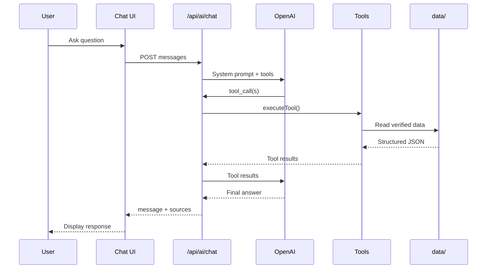

# Hardik Arora — Portfolio

Personal portfolio website built with Next.js, featuring projects, skills, experience, and a **Personal AI Agent** powered by OpenAI tool calling.

## Personal AI Agent

This portfolio includes an AI assistant that answers questions about Hardik's professional background — projects, skills, experience, education, certifications, and contact information.

The assistant uses **verified structured data** and **OpenAI function/tool calling**. It does not use RAG, embeddings, or vector databases.

## Architecture

```text
User (Browser)
   ↓
POST /api/ai/chat
   ↓
Next.js Server (Agent Service)
   ↓
OpenAI API
   ↓
Tool / Function Calling
   ↓
Structured Personal Data (data/)
   ↓
OpenAI (final response)
   ↓
Chat UI
```

### How the Personal Agent Works

1. User asks a question in the chat UI.
2. The browser sends the conversation to `POST /api/ai/chat`.
3. The server sends the message, system prompt, and available tools to OpenAI.
4. OpenAI decides which personal-data tools are relevant.
5. The server executes the requested tools locally.
6. Tools return verified structured data from `data/`.
7. Tool results are sent back to OpenAI.
8. OpenAI generates the final natural-language response.
9. The response is returned to the browser.



## Tool Architecture

Deterministic tools expose specific categories of verified information:

| Tool | Returns |
|---|---|
| `getProfile` | Name, title, bio, location |
| `getExperience` | Work experience (FlyRank AI) |
| `getSkills` | Skills by category |
| `getProjects` | Project portfolio |
| `getEducation` | Academic background |
| `getCertifications` | Professional certifications |
| `getAchievements` | Hackathons and awards |
| `getResearch` | IEEE review paper |
| `getPatent` | Smart Water Bottle patent |
| `getCodingProfiles` | GitHub, LeetCode, GFG, Codolio |
| `getContact` | Email, phone, location, links |

Tools are defined in `lib/agent/tools.ts` and read from typed data in `data/`.

## Security

- OpenAI API key is **server-side only** (`OPENAI_API_KEY`).
- Never expose the key with `NEXT_PUBLIC_` prefix.
- Input validation: empty messages rejected, 4000 character limit.
- Tool loop capped at 5 iterations.
- Generic error messages returned to users; technical details logged server-side only.
- Lightweight in-memory rate limiting (30 requests/hour per IP). On Vercel serverless, limits are per-instance — see `lib/rate-limit.ts`.

## Environment Variables

Copy `.env.example` to `.env.local`:

```env
OPENAI_API_KEY=your_openai_api_key

# Optional
# OPENAI_MODEL=gpt-4o-mini

# Existing contact form (EmailJS)
NEXT_PUBLIC_EMAILJS_SERVICE_ID=
NEXT_PUBLIC_EMAILJS_TEMPLATE_ID=
NEXT_PUBLIC_EMAILJS_PUBLIC_KEY=
```

## Local Development

```bash
npm install --legacy-peer-deps
cp .env.example .env.local
# Add your OPENAI_API_KEY to .env.local
npm run dev
```

Open [http://localhost:3000](http://localhost:3000) and click the sparkle button or **Ask My AI** in the hero.

## Scripts

```bash
npm run dev      # Start development server
npm run build    # Production build
npm run start    # Start production server
npm run lint     # Run ESLint
```

## Project Structure (AI Agent)

```text
app/api/ai/chat/route.ts    # API endpoint
components/ai-agent.tsx     # Floating button + provider
components/ai-chat-window.tsx
components/ai-message.tsx
lib/openai.ts               # OpenAI client
lib/agent.ts                # Agent orchestration
lib/agent/tools.ts          # Tool registry
lib/agent/system-prompt.ts
lib/rate-limit.ts
data/                       # Verified personal data
types/personal.ts           # TypeScript interfaces
```

## Tech Stack

- Next.js 15 (App Router)
- React 18
- TypeScript
- Tailwind CSS
- Framer Motion
- OpenAI API (tool calling)
- shadcn/ui components

## License

Private portfolio project.
