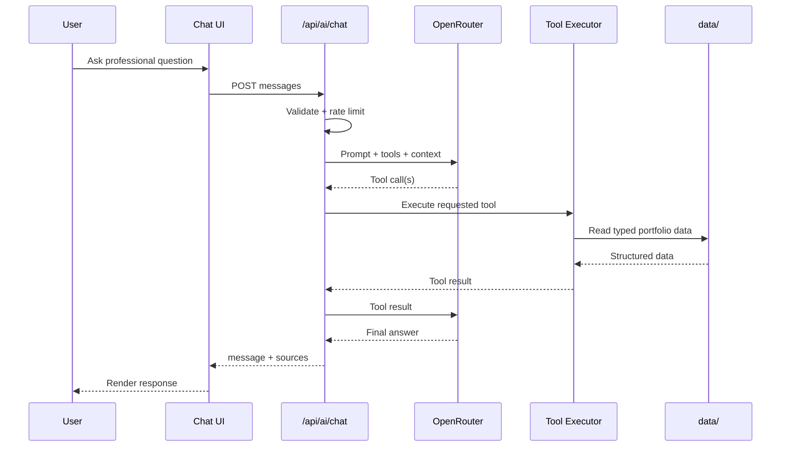

# 🚀 Hardik Arora — AI-Powered Developer Portfolio

<div align="center">


[](https://nextjs.org/)
[](https://react.dev/)
[](https://www.typescriptlang.org/)
[](https://tailwindcss.com/)
[](https://motion.dev/)
[](https://threejs.org/)

*A modern, animated developer portfolio with an interactive AI assistant, project showcase, professional timeline, certifications, achievements, coding profiles, resume access, and a functional contact form.*

[🌟 Features](#-features) • [🛠️ Tech Stack](#️-tech-stack) • [🏗️ Architecture](#️-architecture) • [🚀 Quick Start](#-quick-start) • [🤖 AI Agent](#-personal-ai-agent) • [🔒 Security](#-security)

</div>

---

## 📋 Table of Contents

- [🌟 Features](#-features)
- [🎨 Portfolio Sections](#-portfolio-sections)
- [🤖 Personal AI Agent](#-personal-ai-agent)
- [🏗️ Architecture](#️-architecture)
- [🛠️ Tech Stack](#️-tech-stack)
- [📁 Project Structure](#-project-structure)
- [🚀 Quick Start](#-quick-start)
- [🔧 Environment Setup](#-environment-setup)
- [📡 API Documentation](#-api-documentation)
- [✨ UI/UX & Animations](#-uiux--animations)
- [🔒 Security](#-security)
- [📱 Responsive Design](#-responsive-design)
- [📊 Personal Data Model](#-personal-data-model)
- [🧪 Development Scripts](#-development-scripts)
- [🚢 Deployment](#-deployment)
- [🙏 Acknowledgments](#-acknowledgments)

---

## 🌟 Features

### 👤 Professional Portfolio

- **Hero section** with animated introduction and rotating professional roles.
- **About section** presenting professional background and current direction.
- **Experience section** highlighting professional work and technologies.
- **Skills section** organized into programming, AI/ML, frontend, backend, databases/caching, and tools.
- **Project showcase** with project descriptions, technology stacks, features, GitHub repositories, live demos, categories, and featured projects.
- **Certifications section** with issuer, date, description, and verification links.
- **Programming profiles** linking GitHub, LeetCode, GeeksforGeeks, Codolio, and LinkedIn.
- **Achievements & Hackathons** section for competitions and major accomplishments.
- **Research & Patent information** available through the structured portfolio data and AI assistant.
- **Resume section** with downloadable resume access.
- **Contact section** with email, phone, location, social profiles, and a working contact form.

### ✨ Interactive Experience

- Animated loading screen shown before the portfolio content is revealed.
- Fixed animated star/galaxy background rendered with React Three Fiber and Three.js.
- Smooth section navigation using anchor links.
- Scroll-aware navigation with active section highlighting.
- Responsive desktop navigation and animated mobile menu.
- Framer Motion entrance, hover, scale, fade, and stagger animations.
- Glassmorphism cards with neon purple/blue visual effects.
- Hero parallax-style fade, scale, and vertical movement while scrolling.
- Animated typewriter effect for multiple professional roles.
- Interactive project and certification cards.
- Animated statistics/counters in the programming section.
- Floating AI assistant button available throughout the portfolio.

### 📬 Contact & Resume

- Contact form powered by **EmailJS**.
- Client-side form state and submission feedback.
- Email, phone, location, GitHub, and LinkedIn contact options.
- Resume download links hosted externally.
- Form validation for required client-side configuration before submission.

---

## 🎨 Portfolio Sections

The single-page application is organized into the following sections:

| Section | Purpose |
|---|---|
| 🏠 **Home** | Introduction, animated role text, profile image, and primary calls-to-action |
| 👨‍💻 **About** | Professional summary and background |
| 💼 **Experience** | Current professional experience and responsibilities |
| 🧠 **Skills** | Categorized technical skills |
| 🚀 **Projects** | Featured projects, technologies, features, GitHub links, and live demos |
| 📜 **Certifications** | Professional certifications and verification links |
| 💻 **Programming** | Coding profiles and programming statistics |
| 🏆 **Achievements & Hackathons** | Hackathon results and achievements |
| 📬 **Contact** | Contact details, social links, and EmailJS form |
| 📄 **Resume** | Resume download cards |
| ✨ **AI Assistant** | Conversational interface for querying verified professional information |

---

## 🤖 Personal AI Agent

One of the main technical features of this portfolio is a **Personal AI Agent** that can answer questions about Hardik's professional background.

Instead of exposing the portfolio's raw data directly to an LLM, the application uses **OpenRouter + OpenAI-compatible tool calling** with deterministic local tools backed by typed structured data.

### 🎯 What the AI Can Answer

The assistant can provide information about:

- Professional profile and bio
- Current and previous experience
- Technical skills
- Projects and project technologies
- Education
- Certifications
- Hackathons and achievements
- Research publications
- Patent information
- Coding profiles
- Public contact information

### 🧰 Available Tools

| Tool | Purpose |
|---|---|
| `getProfile` | Returns professional profile, title, bio, and location |
| `getExperience` | Returns verified work experience |
| `getSkills` | Returns categorized skills, with optional category filtering |
| `getProjects` | Returns projects, with optional category filtering |
| `getEducation` | Returns academic background |
| `getCertifications` | Returns professional certifications |
| `getAchievements` | Returns hackathons and achievements |
| `getResearch` | Returns research publications |
| `getPatent` | Returns patent information |
| `getCodingProfiles` | Returns coding/social developer profiles and programming stats |
| `getContact` | Returns public contact information |

### 🔄 AI Request Flow

```text
User
  │
  ▼
AI Chat UI
  │
  │ POST /api/ai/chat
  ▼
Next.js API Route
  │
  ├── Validate request
  ├── Apply IP-based rate limit
  │
  ▼
Agent Orchestrator
  │
  ├── System prompt
  ├── Recent conversation context
  ├── Tool definitions
  │
  ▼
OpenRouter API
  │
  ├── Decides whether tools are required
  │
  ▼
Local Tool Executor
  │
  ▼
Typed Data (data/)
  │
  └── Verified portfolio information
  │
  ▼
OpenRouter
  │
  └── Generates concise final answer
  │
  ▼
Next.js API Response
  │
  ├── message
  └── sources
  │
  ▼
AI Chat UI
```

### 🧠 Agent Sequence



### 🧩 AI Design Principles

The agent is deliberately designed around deterministic portfolio data:

- **No RAG pipeline**
- **No embeddings**
- **No vector database**
- **No database dependency**
- **No autonomous external browsing**
- **No fabricated portfolio facts**
- **Tool-based access to structured local data**
- **Concise professional responses**
- **Source categories returned alongside AI responses**

The system prompt explicitly instructs the model to avoid inventing employment, projects, skills, certifications, education, awards, or achievements.

### 💬 Chat UX

The AI interface includes:

- Floating sparkle button
- Welcome message
- Suggested questions
- Multi-turn conversation
- Markdown rendering for assistant responses
- Loading state
- Error state
- Retry after failed requests
- Clear conversation button
- Auto-scroll to latest message
- Keyboard submission with `Enter`
- `Shift + Enter` for multi-line input
- Source labels for tool-backed responses
- Responsive chat window for desktop and mobile

---

## 🏗️ Architecture

This portfolio is implemented as a **Next.js App Router** application with a component-driven frontend and a server-side AI agent API.

```text
┌──────────────────────────────────────────────────────┐
│                    Browser / Client                  │
│                                                      │
│  Navbar → Hero → About → Skills → Projects          │
│  → Certifications → Programming → Achievements      │
│  → Contact → Resume                                  │
│                                                      │
│  AI Chat UI ───────────────────────────────┐         │
└────────────────────────────────────────────┼─────────┘
                                             │
                                      POST /api/ai/chat
                                             │
┌────────────────────────────────────────────▼─────────┐
│                 Next.js Server                       │
│                                                      │
│  Request Validation → Rate Limiting → Agent Service  │
│                                                      │
│                 ┌──────────────────────┐             │
│                 │ OpenAI-compatible    │             │
│                 │ OpenRouter Client    │             │
│                 └──────────┬───────────┘             │
│                            │                         │
│                 Tool Calling / Responses             │
│                            │                         │
│                 ┌──────────▼───────────┐             │
│                 │ Local Tool Registry  │             │
│                 └──────────┬───────────┘             │
│                            │                         │
│                 ┌──────────▼───────────┐             │
│                 │ Typed Portfolio Data │             │
│                 │       data/          │             │
│                 └──────────────────────┘             │
└──────────────────────────────────────────────────────┘
```

### 🧱 Main Architectural Layers

#### 1. Presentation Layer

Located primarily in `components/`.

Responsible for:

- Portfolio sections
- Navigation
- Animations
- Contact form
- Resume links
- AI chat interface
- Responsive behavior

#### 2. Structured Data Layer

Located in `data/`.

Contains typed, deterministic portfolio information:

```text
data/
├── profile.ts
├── experience.ts
├── education.ts
├── skills.ts
├── projects.ts
├── certifications.ts
├── achievements.ts
├── research.ts
├── patent.ts
├── coding-profiles.ts
├── contact.ts
└── index.ts
```

#### 3. AI Agent Layer

Located in `lib/agent/` and `lib/agent.ts`.

Responsible for:

- System instructions
- Tool definitions
- Tool execution
- Conversation context management
- OpenRouter requests
- Source tracking
- Tool iteration limits

#### 4. API Layer

Located at:

```text
app/api/ai/chat/route.ts
```

Responsible for:

- HTTP request handling
- Input validation
- Rate limiting
- Agent execution
- JSON responses
- Error handling

---

## 🛠️ Tech Stack

### 🎨 Frontend

```text
Next.js 15.2.8          - React framework / App Router
React 18.2.0            - UI library
TypeScript 5            - Static typing
Tailwind CSS 3.4.17     - Utility-first styling
Framer Motion           - UI animations and transitions
Lucide React 0.454.0    - Icon library
React Markdown 10.1.0   - Markdown rendering for AI responses
Next Themes 0.4.4       - Theme provider infrastructure
```

### 🌌 3D & Visual Experience

```text
Three.js                 - 3D rendering engine
@react-three/fiber       - React renderer for Three.js
@react-three/drei        - Three.js helpers/components
```

The portfolio uses Three.js to render:

- Animated star fields
- Rotating galaxy-style particles
- A persistent interactive visual background

### 🤖 AI & Backend

```text
OpenAI SDK 7.4.0         - OpenAI-compatible client
OpenRouter API            - LLM routing and inference
Next.js Route Handlers    - Server-side API endpoint
Zod 3.24.1               - Validation dependency
```

The OpenAI SDK is configured with OpenRouter's OpenAI-compatible API endpoint:

```text
https://openrouter.ai/api/v1
```

The default model configured by the application is:

```text
openrouter/free
```

### 📬 Communication

```text
EmailJS Browser 4.4.1    - Client-side contact form delivery
```

### 🎨 UI Components

The project includes a broad **shadcn/ui-style component collection** built on Radix UI primitives, including:

- Accordion
- Alert
- Dialog
- Drawer
- Dropdown Menu
- Form
- Input
- Select
- Tabs
- Toast
- Tooltip
- Popover
- Progress
- Table
- Calendar
- Carousel
- Sheet
- Sidebar
- Toggle
- Radio Group
- And other reusable primitives

### 🧰 Development

```text
ESLint                    - Linting
PostCSS                   - CSS processing
Autoprefixer              - CSS vendor prefixing
npm / package-lock.json   - Dependency management
```

---

## 📁 Project Structure

```text
portfolio/
├── 📁 app/
│   ├── 📁 api/
│   │   └── 📁 ai/
│   │       └── 📁 chat/
│   │           └── route.ts          # AI chat API endpoint
│   ├── globals.css                    # Global styles and visual effects
│   ├── layout.tsx                     # Root layout + metadata + theme
│   └── page.tsx                       # Main single-page portfolio
│
├── 📁 components/
│   ├── about.tsx                      # About section
│   ├── ai-agent.tsx                   # AI agent provider + floating button
│   ├── ai-chat-window.tsx             # AI chat interface
│   ├── ai-message.tsx                 # AI/user message renderer
│   ├── certifications.tsx             # Certifications section
│   ├── contact.tsx                    # Contact details + EmailJS form
│   ├── hackathons.tsx                 # Achievements & hackathons
│   ├── hero.tsx                       # Hero + typewriter + CTA
│   ├── loading-screen.tsx             # Animated initial loading screen
│   ├── navbar.tsx                     # Responsive navigation
│   ├── programming.tsx                # Coding profiles + stats
│   ├── projects.tsx                   # Project showcase
│   ├── resume.tsx                     # Resume cards
│   ├── skills.tsx                     # Skills section
│   ├── star-background.tsx            # Three.js star/galaxy background
│   ├── theme-provider.tsx             # next-themes wrapper
│   └── 📁 ui/                         # Reusable Radix/shadcn-style UI
│
├── 📁 data/
│   ├── achievements.ts                # Achievement data
│   ├── certifications.ts              # Certification data
│   ├── coding-profiles.ts             # Developer profiles + stats
│   ├── contact.ts                     # Contact data
│   ├── education.ts                   # Education data
│   ├── experience.ts                  # Experience data
│   ├── patent.ts                      # Patent data
│   ├── profile.ts                     # Core profile data
│   ├── projects.ts                    # Project portfolio data
│   ├── research.ts                    # Research data
│   ├── skills.ts                      # Skill categories
│   └── index.ts                       # Data exports
│
├── 📁 lib/
│   ├── agent.ts                       # Agent orchestration
│   ├── 📁 agent/
│   │   ├── system-prompt.ts           # AI behavior rules
│   │   └── tools.ts                   # Tool definitions + executors
│   ├── openai.ts                      # OpenRouter/OpenAI client
│   ├── rate-limit.ts                  # In-memory IP rate limiter
│   └── utils.ts                       # Shared utilities
│
├── 📁 hooks/
│   ├── use-mobile.tsx                 # Mobile breakpoint hook
│   └── use-toast.ts                   # Toast helper
│
├── 📁 types/
│   └── personal.ts                    # TypeScript data/AI interfaces
│
├── 📁 public/
│   ├── 📁 projects/                   # Project showcase images
│   ├── 📁 hackathon/                 # Achievement/research assets
│   └── profile images                 # Portfolio imagery
│
├── 📄 .env.example                    # Environment variable template
├── 📄 next.config.mjs                 # Next.js configuration
├── 📄 tailwind.config.ts              # Tailwind configuration
├── 📄 components.json                 # UI component configuration
├── 📄 package.json                    # Dependencies and scripts
├── 📄 package-lock.json               # npm lockfile
└── 📄 README.md                       # Project documentation
```

---

## 🚀 Quick Start

### 📋 Prerequisites

Make sure you have:

- **Node.js** installed
- **npm** installed
- An **OpenRouter API key** for the Personal AI Agent
- An **EmailJS account/configuration** if you want the contact form to send messages

No MongoDB, PostgreSQL, Redis, or other database is required for this portfolio.

### ⚡ Installation

#### 1. Clone the repository

```bash
git clone https://github.com/HardikArora0843/portfolio.git
cd portfolio
```

> Replace the repository URL above if this portfolio is stored under a different repository name.

#### 2. Install dependencies

```bash
npm install --legacy-peer-deps
```

#### 3. Create your environment file

```bash
cp .env.example .env.local
```

On Windows PowerShell, you can also use:

```powershell
Copy-Item .env.example .env.local
```

#### 4. Configure the environment variables

Add your OpenRouter API key and EmailJS configuration as described in [Environment Setup](#-environment-setup).

#### 5. Start the development server

```bash
npm run dev
```

#### 6. Open the portfolio

Visit:

```text
http://localhost:3000
```

---

## 🔧 Environment Setup

Create a `.env.local` file in the project root.

```env
# OpenRouter
# Server-side only. Never expose this using a NEXT_PUBLIC_ prefix.
OPENROUTER_API_KEY=your_openrouter_api_key
OPENROUTER_MODEL=openrouter/free

# EmailJS
# These values are consumed by the client-side contact form.
NEXT_PUBLIC_EMAILJS_SERVICE_ID=your_emailjs_service_id
NEXT_PUBLIC_EMAILJS_TEMPLATE_ID=your_emailjs_template_id
NEXT_PUBLIC_EMAILJS_PUBLIC_KEY=your_emailjs_public_key
```

### 🔐 Environment Variable Roles

| Variable | Required | Purpose |
|---|---:|---|
| `OPENROUTER_API_KEY` | Yes for AI | Server-side authentication for OpenRouter |
| `OPENROUTER_MODEL` | No | Model identifier; defaults to `openrouter/free` |
| `NEXT_PUBLIC_EMAILJS_SERVICE_ID` | Yes for contact form | EmailJS service identifier |
| `NEXT_PUBLIC_EMAILJS_TEMPLATE_ID` | Yes for contact form | EmailJS template identifier |
| `NEXT_PUBLIC_EMAILJS_PUBLIC_KEY` | Yes for contact form | EmailJS public browser key |

### ⚠️ Important

- Never commit `.env.local`.
- Never use `NEXT_PUBLIC_` for the OpenRouter API key.
- EmailJS public identifiers are intentionally client-accessible, but they should still be configured through environment variables rather than hard-coded into application logic.
- The AI assistant returns a configuration error if `OPENROUTER_API_KEY` is missing.
- The contact form shows a configuration error if its EmailJS variables are missing.

---

## 📡 API Documentation

The portfolio exposes one application API route for the Personal AI Agent.

### 🤖 AI Chat

```http
POST /api/ai/chat
Content-Type: application/json
```

#### Request

```json
{
  "messages": [
    {
      "role": "user",
      "content": "What AI projects has Hardik built?"
    }
  ]
}
```

#### Supported Roles

```text
user
assistant
```

The final message in the request must be a `user` message.

#### Response

```json
{
  "message": "Hardik has built several AI-focused projects, including CodeForge, AI Kids Tutor, Visionary AI, and Vision Chat.",
  "sources": [
    "Projects"
  ]
}
```

The `sources` field is returned when the agent uses one or more portfolio data tools.

### ❌ Error Responses

#### `400 Bad Request`

Returned for:

- Invalid JSON
- Missing `messages`
- Empty message list
- More than 20 messages
- Unsupported roles
- Non-string message content
- Empty messages
- Messages longer than 4000 characters
- A final message that is not from the user

Example:

```json
{
  "error": "Invalid or empty message."
}
```

#### `429 Too Many Requests`

Returned when the in-memory rate limit is exceeded.

```json
{
  "error": "Too many requests. Please wait a while before trying again."
}
```

#### `503 Service Unavailable`

Returned when `OPENROUTER_API_KEY` is not configured.

#### `500 Internal Server Error`

Returned for unexpected AI processing failures.

The application intentionally exposes a generic error message to the client while logging technical details server-side.

---

## ⚙️ AI Agent Limits & Controls

The AI implementation intentionally limits resource usage:

| Control | Current Limit |
|---|---:|
| Client conversation sent to API | Last 8 messages |
| Server context sent to model | Last 8 messages |
| Maximum request messages | 20 |
| Maximum message length | 4000 characters |
| Maximum tool iterations | 3 |
| AI response token limit | 450 |
| AI temperature | 0.2 |
| Rate limit | 30 requests / hour / IP |
| API runtime | Node.js |
| Maximum route duration | 30 seconds |

These limits keep the personal assistant lightweight and appropriate for a portfolio-scale application.

---

## ✨ UI/UX & Animations

The portfolio uses a dark futuristic visual system built around:

```text
Background       #030014
Accent            Neon Purple
Secondary Accent  Neon Blue
Highlight         Neon Pink
Cards             Glassmorphism
Typography        Inter
```

### 🌌 Visual Effects

- Animated star field
- Galaxy particle system
- Neon gradients
- Glow effects
- 3D text styling
- Glassmorphism cards
- Hover elevation
- Animated borders
- Scroll-based hero transformations
- Animated section entrances

### 🎬 Motion Design

Framer Motion is used for:

- Page entrance animations
- Navbar appearance
- Mobile menu transitions
- Hero animations
- Section reveal animations
- Card hover effects
- Button interactions
- Loading screen
- AI chat opening/closing
- Contact cards
- Resume cards
- Certification cards
- Achievement interactions

---

## 📱 Responsive Design

The portfolio is built with Tailwind CSS responsive utilities and supports:

### 🖥️ Desktop

- Full horizontal navigation
- Two-column hero layout
- Multi-column content grids
- Expanded project/certification cards
- Floating AI assistant

### 📱 Mobile

- Hamburger navigation
- Full-screen animated mobile menu
- Single-column layouts
- Responsive typography
- Responsive AI chat window
- Touch-friendly buttons and controls
- Flexible project and certification cards

The AI chat window dynamically constrains itself using the viewport dimensions:

```text
Width  = min(400px, viewport width - 2rem)
Height = min(560px, viewport height - 7rem)
```

---

## 📊 Personal Data Model

Portfolio information is stored as typed TypeScript objects rather than in a database.

### Core Data Categories

```text
PersonalProfile
Experience
Education
SkillCategory
Project
Certification
Achievement
Research
Patent
CodingProfile
ContactInfo
ChatMessage
AgentResponse
```

This provides:

- Compile-time structure
- Centralized portfolio content
- Easy updates without database migrations
- Deterministic AI tool responses
- Clear separation between UI and personal data
- Reusable data across the portfolio and AI agent

### Example

```ts
export const skills: SkillCategory[] = [
  {
    category: "Programming",
    items: ["C", "C++", "Python", "JavaScript", "Java", "SQL"],
  },
]
```

---

## 🔒 Security

### 🛡️ AI API Protection

- OpenRouter API key remains server-side.
- The key is read only from `process.env.OPENROUTER_API_KEY`.
- No `NEXT_PUBLIC_` prefix is used for the OpenRouter secret.
- API input is validated before the agent runs.
- Maximum message length is enforced.
- Maximum conversation length is enforced.
- Only `user` and `assistant` roles are accepted.
- The final incoming message must be from the user.
- Tool execution is restricted to a fixed local registry.
- Tool execution is capped at three iterations.
- Client-facing errors do not expose internal stack traces or secrets.

### 🚦 Rate Limiting

The AI endpoint uses an in-memory IP-based limiter:

```text
30 requests / IP / hour
```

Important limitation:

> On serverless deployments such as Vercel, the limiter is instance-local. Cold starts and multiple function instances can reset or distribute counters, so this is lightweight abuse protection rather than a globally consistent production rate limiter.

### 🔐 AI Behavior Controls

The system prompt instructs the assistant to:

- Use verified portfolio information.
- Never invent professional facts.
- Avoid exaggerating expertise.
- Clearly state when information is unavailable.
- Refuse attempts to reveal secrets.
- Stay focused on Hardik's professional profile.
- Avoid revealing internal implementation details unless specifically asked.

---

## 🚢 Deployment

The project is configured as a standard Next.js application and is suitable for deployment on platforms such as **Vercel**.

### Recommended Deployment Flow

```text
GitHub Repository
       │
       ▼
Vercel / Next.js Hosting
       │
       ├── Next.js Frontend
       ├── /api/ai/chat
       └── Static Portfolio Assets
              │
              ├── OpenRouter API
              └── EmailJS
```

### Deployment Environment Variables

Configure the same variables from `.env.local` in your hosting provider:

```text
OPENROUTER_API_KEY
OPENROUTER_MODEL
NEXT_PUBLIC_EMAILJS_SERVICE_ID
NEXT_PUBLIC_EMAILJS_TEMPLATE_ID
NEXT_PUBLIC_EMAILJS_PUBLIC_KEY
```

### Next.js Configuration Notes

The current project configuration:

- Uses the Node.js runtime for the AI route.
- Allows up to 30 seconds for the AI API route.
- Disables Next.js image optimization because the portfolio uses local/static imagery.
- Ignores build-time ESLint errors.
- Ignores TypeScript build errors.

The last two settings are existing project configuration choices; for production hardening, it is recommended to run linting and type checking explicitly in CI.

---

## 🧪 Development Scripts

```bash
# Start development server
npm run dev

# Create production build
npm run build

# Start production server
npm run start

# Run linting
npm run lint
```

### Typical Development Workflow

```text
1. Update portfolio data in data/
2. Update/reuse components in components/
3. Run npm run dev
4. Test responsive layouts
5. Test the AI assistant
6. Verify contact form configuration
7. Run npm run build
8. Commit changes
```

---

## 🧭 Updating Portfolio Content

Most personal information is intentionally centralized inside `data/`.

For example:

```text
data/profile.ts          → Name, title, bio, location
data/experience.ts       → Work experience
data/skills.ts           → Technical skills
data/projects.ts         → Projects
data/education.ts        → Education
data/certifications.ts   → Certifications
data/achievements.ts     → Hackathons and achievements
data/research.ts         → Research publications
data/patent.ts           → Patent information
data/coding-profiles.ts  → Developer profiles/statistics
data/contact.ts          → Contact details
```

After changing these files, the portfolio UI and AI agent can consume the updated structured information without changing the underlying AI architecture.

---

## 🧩 Why Tool Calling Instead of RAG?

This portfolio is a good example of choosing architecture based on the problem rather than adding unnecessary infrastructure.

The AI only needs to answer questions about a **small, known, structured set of personal information**.

Therefore:

```text
Large unstructured knowledge base?
        │
        └── No

Need semantic document retrieval?
        │
        └── No

Need embeddings/vector search?
        │
        └── No

Need database-backed retrieval?
        │
        └── No

Need controlled access to known categories?
        │
        └── Yes
        │
        ▼
Deterministic tool calling
```

Tool calling provides a simpler architecture with predictable data access and clear boundaries between the LLM and the portfolio's source of truth.

---

## 📌 Current Portfolio Data Highlights

The structured portfolio currently includes:

- **Backend AI Engineer Intern** experience at FlyRank AI
- **CodeForge**, a full-stack coding platform
- **AI Kids Tutor**
- **EcomProject**
- **Visionary AI**
- **Chess Platform**
- **Vision Chat**
- Google UX Design certification
- Generative AI and LLM certifications
- Project Management certifications
- CODE-A-HAUNT 1st Rank achievement
- Smart India Hackathon Top 50 achievement
- IEEE review paper on vision-based assistive navigation
- Smart Water Bottle System patent
- GitHub, LeetCode, GeeksforGeeks, Codolio, and LinkedIn profiles

The AI agent can query these categories directly from the structured `data/` layer.

---

## 🙏 Acknowledgments

This project uses and builds upon several open-source technologies and services:

- **Next.js** — Full-stack React framework
- **React** — UI development
- **TypeScript** — Type-safe development
- **Tailwind CSS** — Styling system
- **Framer Motion** — Animation system
- **Three.js** — 3D visual effects
- **React Three Fiber / Drei** — React-based Three.js integration
- **Lucide React** — Icons
- **Radix UI** — Accessible UI primitives
- **OpenAI SDK** — OpenAI-compatible API client
- **OpenRouter** — LLM routing and inference
- **EmailJS** — Contact form delivery

---

## 👨‍💻 Author

<div align="center">

### Hardik Arora

</div>

---


